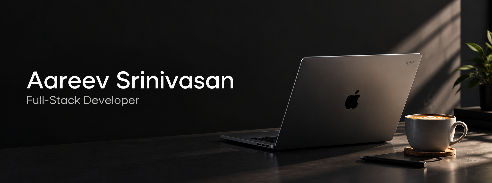

  

  
  
  

---

### About Me

Second-year engineering undergraduate, full-stack developer, and UI/UX designer focused on building scalable web products and clean digital experiences. 

- **Venture** — Working on and am the Co-founder, CTO & CMO at $\small\textsf{\textbf{fix\color{#FD5803}karu}}$
- **Core Focus** — Full-Stack Development, DSA & Interface Engineering
- **Current Stack** — Building with TypeScript and modern web architectures
- **Future Roadmap** — Exploring applied Artificial Intelligence & Business with an interest to explore robotics in the future

---

## Projects

<table align="center" width="100%">
  <tr>
    <td width="50%" valign="top">
      <h3>
        <a href="https://github.com/Aareevs/Vaani-Setu-Website">Vaani Setu Website</a> &nbsp;<a href="https://vaani-setu-website.vercel.app" title="Live Demo">↗</a>
      </h3>
      
Platform that converts sign language output to text/speech.

      

        
        
      

    </td>
    <td width="50%" valign="top">
      <h3>
        <a href="https://github.com/Aareevs/Vaani-Setu-Mobile-App">Vaani Setu App</a>
      </h3>
      
Mobile Application of Vaani Setu.

      

        
        
      

    </td>
  </tr>
  <tr>
    <td width="50%" valign="top">
      <h3>
        <a href="https://github.com/Aareevs/AI_Assistant_Fuli">Fuli</a>
      </h3>
      
Autonomous macOS desktop operator and hands-free voice assistant for system automation and in-place browser control.

      

        
        
      

    </td>
    <td width="50%" valign="top">
      <h3>
        <a href="https://github.com/Aareevs/Aareevs-Windows-10-OS-Portfolio">My Portfolio</a> &nbsp;<a href="https://aareevsrinivasan.com" title="Live Website">↗</a>
      </h3>
      
My Portfolio website that has the characterestics of a classic Windows 10 Experience.

      

        
        
      

    </td>
  </tr>
</table>

 

---

## Technical Stack

| Currently know | I'm learning |
| :---: | :---: |
|  |  |

---

### **GitHub Stats**

  <table border="0">
    <tr>
      <td>
        
      </td>
      <td>
        
      </td>
    </tr>
  </table>

---

   “Simplicity is the soul of efficiency.” - Austin Freeman 

   
  

